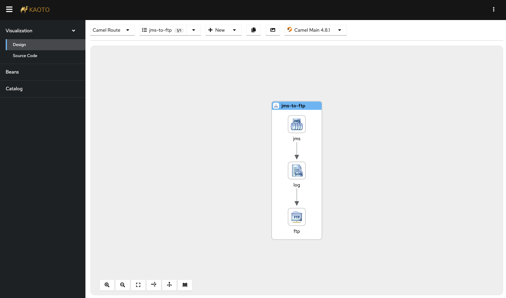

= ActiveMQ to FTP

This example shows how to integrate ActiveMQ with FTP server.

== Install Camel JBang

include::../install.adoc[see installation]

== Running ActiveMQ and FTP server

You need both an ActiveMQ Artemis broker, and FTP server up and running.

You can run both via Docker Compose (or Podman)

[source,shell]
----
docker compose up --detach
----

== How to run

Then you can run this example using:

[source,shell]
----
camel run *
----

== Sending Messages to ActiveMQ

When the example is running, you need to trigger Camel, by sending messages to the ActiveMQ broker.
You can either do this via the broker web console http://localhost:8161 (login with `artemis/artemis`
or by using Camel JBang:

[source,shell]
----
camel cmd send --body=file:test/payload.xml
----

== Browsing FTP server

When you have sent some messages to ActiveMQ Camel will route these to the FTP server.
To see which files have been uploaded, you can start a remote shell into the Docker container or use Camel JBang:

[source,shell]
----
camel cmd browse
----

Which shows a status page of pending messages in the systems.

To see the content of these messages, you can tell Camel to dump via

[source,shell]
----
camel cmd browse --dump
----

TIP: To see more options use `camel cmd browse --help`.

== Developer Web Console

You can enable the developer console via `--console` flag as show:

[source,shell]
----
camel run * --console
----

Then you can browse: http://localhost:8080/q/dev to introspect the running Camel Application.

== Integration testing

The example provides an automated integration test (`ftp.camel.it.yaml`) that you can run with the https://citrusframework.org/[Citrus] test framework.
Please make sure to install Citrus as a JBang application (see link:../../install-citrus.adoc[Citrus installation guide]).

You may run the test with:

[source,shell]
----
cd test
citrus run ftp.camel.it.yaml
----

== More Information

This example was also covered in the following YouTube video: https://youtu.be/V0sBmE8rcVg

== Help and contributions

If you hit any problem using Camel or have some feedback, then please
https://camel.apache.org/community/support/[let us know].

We also love contributors, so
https://camel.apache.org/community/contributing/[get involved] :-)

The Camel riders!
